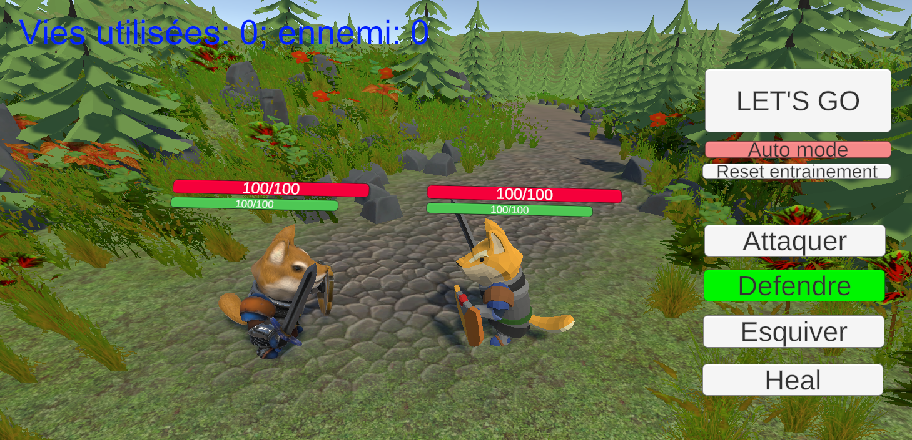

# QDonjon

## Description
QDonjon est un projet de jeu développé avec Unity. Ce projet inclut diverses animations, ressources, scènes et scripts.
Il met au coeur de l'expérience l'implémentation d'un reinforcement learning pour l'IA du jeu.

## Fonctionnalités

Le jeu est en 2 parties : 
- La première est une partie entrainement
- La seconde est une partie jeu automatique en fonction de ce qui a été appris par l'IA lors de la première partie.

## Illustration


## Structure du projet
- **Assets/** : Contient toutes les ressources du jeu, y compris les animations, les monstres, la décoration, les scripts, etc.
- **Library/** : Contient les fichiers de bibliothèque générés par Unity.
- **Logs/** : Contient les fichiers de log générés pendant le développement.
- **Packages/** : Contient les packages utilisés dans le projet.
- **ProjectSettings/** : Contient les paramètres du projet Unity.
- **UserSettings/** : Contient les paramètres utilisateur spécifiques.

## Prérequis
- Unity 2021.3.17f1 ou supérieur
- .NET Framework 4.7.1 ou supérieur

## Installation
1. Clonez le dépôt :
    ```sh
    git clone <URL_DU_DEPOT>
    ```
2. Ouvrez le projet dans Unity :
    - Lancez Unity Hub.
    - Cliquez sur "Add" et sélectionnez le dossier du projet cloné.

## Utilisation
- Pour lancer le jeu, ouvrez la scène principale dans le dossier `Assets/Scenes` et cliquez sur le bouton "Play" dans l'éditeur Unity.
- Pour modifier les scripts, ouvrez le dossier `Assets/Script` et éditez les fichiers avec votre éditeur de code préféré.

## Licence
Ce projet est sous licence MIT. Voir le fichier [LICENSE](LICENSE) pour plus de détails.

## Auteurs
- **TESSADRI Nathan**
- **GOUBIN Tristan**
- **GUERIAU Maxime**